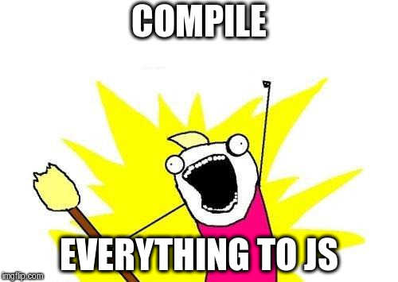
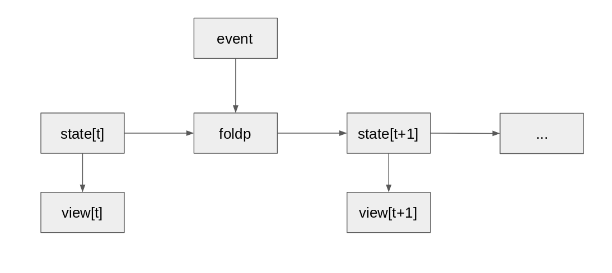

title: A pragmatic intro to PureScript
class: animation-fade
layout: true

<!-- This slide will serve as the base layout for all your slides -->
.bottom-bar[
  {{title}}
]

---

class: impact

# {{title}}


---

class: center

# How we do JS in 2018

--


---

# Available options

- Babel
--

- TypeScript
--

- Elm
--

- ReasonML
--

- ClojureScript
--

---

# What about PureScript ?

- Functional
--

- Statically typechecked
--

- Easy interoperability to / from JavaScript*
--

- Heavily inspired from Haskell
--

- No laziness
--


.small[
<i>*sorry Oracle for using the word JavaScript</i>
]

---

## The toolbox

### Deps management

- [npm](https://docs.npmjs.com/) : to install the tooling
- [bower](https://bower.io/) / [psc-package](https://github.com/purescript/psc-package) : for purescript dependency management
- [psvm](https://www.npmjs.com/package/psvm) : for managing PureScript compiler versions

---

## The toolbox

### Scaffolding

- [pulp](https://github.com/pulp/pulp)

```sh
> mkdir my-awesome-project
> cd my-awesome-project
> pulp init
```

---

## The toolbox

### For building

#### # simple script

```
pulp build
```

#### # more kikoo frontend stuff

- [webpack](https://webpack.js.org/)
- [purs-loader](https://github.com/ethul/purs-loader)

---

## A simple module

```purescript
module Main where

import Prelude
import Control.Monad.Eff (Eff)
import Control.Monad.Eff.Console (CONSOLE, log)

main :: forall e. Eff (console :: CONSOLE | e) Unit
main = do
  log "Hello sailor!"
```

---

## Modules, modules, modules

Haskell module declaration style...

```purescript
module Main where
```

--
... and also for imports

```purescript
import Prelude

import Data.List as L

import All.MyHelpers (doSomeFancyStuff)

import All.OtherHelpers hiding (breakTheBuild)
```
---

## Existential types by default (and mandatory)

In Haskell:

```haskell
identity :: a -> a
identity x = x
```

In PureScript:

```purescript
identity :: forall a. a -> a
identity x = x
```

---

## Boring ADTs

```purescript
data AsyncAction a b
	= NotLoaded
	| Loading
	| Success a
	| Failure b
```

---

## Records made easy...

```purescript
type User = { firstName :: String
			, lastName  :: String
			}
```

---

## ... and extensible

```purescript
type Person u
	= { firstName :: String
	  , lastName :: String
	  | u
	  }

greeting :: forall u. Person u -> String
greeting { firstName, lastName } = fold [ "Hello, "
										, firstName
										, " "
										, lastName
										]
```

---

## Much object notation for record

```purescript
greeting person = fold [ "Hello, "
					   , person.firstName
					   , " "
					   , person.lastName
					   ]
```

---

## Anonymous functions

```purescript
filter (\name -> name == searchKey)
```

or

```purescript
filter (_ == searchKey)
```

---

class: center


---

## Row effects

- Allow to track different side-effects in an extensible way

```purescript
type MainEffects eff = (console :: CONSOLE, dom :: DOM | eff)
```

_later_

```purescript
type AppEffects eff = MainEffects (ajax :: AJAX | eff)
```

_And then_

```purescript
performSomeStuff :: forall eff. Eff (AppEffects eff) MuchResult
```

---

## Or...

[purescript-io](https://github.com/slamdata/purescript-io)

```purescript
runIO :: forall a. IO a -> Aff (infinity :: INFINITY) a
```

---

## Typeclasses

Almost like Haskell

```purescript
instance showMyAwesomeType :: Show MyAwesomeType where
	show (MyAwesomeType content) = show content
```

---

## Foreign Function Interface

```js
/* StringUtils.js */

exports.append = function (a) {
	return function (b) {
		return a + b;
	}
}
```

```purescript
module StringUtils where

foreign import append :: String -> String -> String
```

---

## Foreign Function Interface - Part 2

```js
exports.appendImpl = function (a, b) {
	return a + b;
}
```

```purescript
module StringUtils where

import Data.Function.Uncurried

foreign import appendImpl :: Fn2 String String String

append :: String -> String -> String
append = runFn2 appendImpl
```

---

---

## Let's do some UI
--

- [purescript-pux](https://github.com/alexmingoia/purescript-pux)
	- easy to learn
	- architecture similar to Elm

- [purescript-halogen](https://github.com/slamdata/purescript-halogen)
	- a bit more complex to grasp
	- more oriented towards autonomous components

---

## Pux



---

## Pux - The app

```purescript
module Main where

-- Put a bunch of imports here

main :: forall fx. Eff (CoreEffects fx) Unit
main = do
	app <- start { initialState
				 , view
				 , foldp
				 , inputs: []
				 }

	renderToDOM "#my-app" app.markup app.input
```

---

## Pux - The state

```purescript
module State where

type State = { message :: String }

initialState :: State
initialState = { message: "Hello !" }
```

---

## Pux - Events

```purescript
module Events where

data Events
	= SayHelloTo String
	| SayGoodbye
```
---

## Pux - State updates

```purescript
module EventHandler where

foldp :: forall fx. Event -> State -> EffModel State Event fx
foldp (SayHelloTo name) state = { state: newState, effects: [] }
	where
		newState = state { message = "Oh hi " <> name }
foldp SayGoodbye state = { state: newState, effects: [] }
	where
		newState = state { message = "See you soon !" }
```

---

## Pux - Views

```purescript
module View where

-- Put a bunch of imports here

view :: State -> HTML Event
view { message } = div ! className "main-layout" $ do
	h1 $ text "Disruptive serverless chatbot"
	p $ text message
```

Monadic HTML DSL FTW via Smolder o/

---

## Good parts

- Typesafe
--

- A lot of stuff of Haskell are here
--

- A great community
--

- Easy experimentation on architecture / abstractions
--

- Interoperability with JS
--

- the bases of the language are small
--

- Not JS
--


---

## Not so good parts

- `<<<` instead of `.` for composition
--

- More generally, some frustrating differences with well known Haskell libraries and their PS equivalent
--

- Separation of concerns pushed a bit too far
--

- Not Haskell
--

	- no GADTs
	- no Type Family
	- no Template Haskell
	- no language extensions

---

class: center

## Thanks for listening, questions ?


